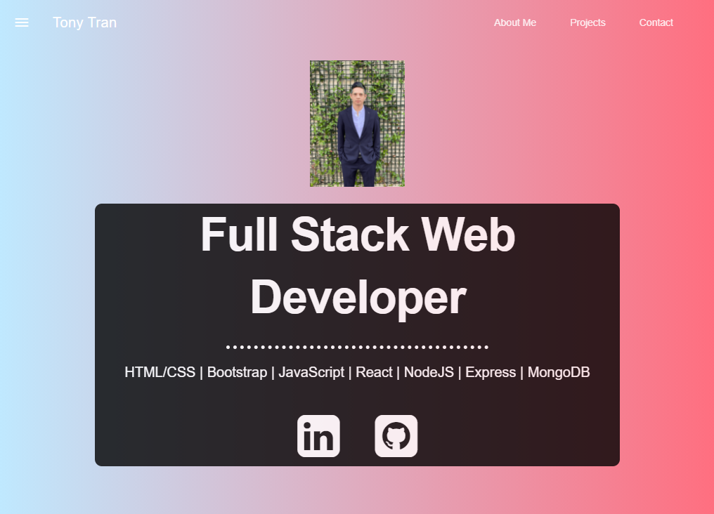
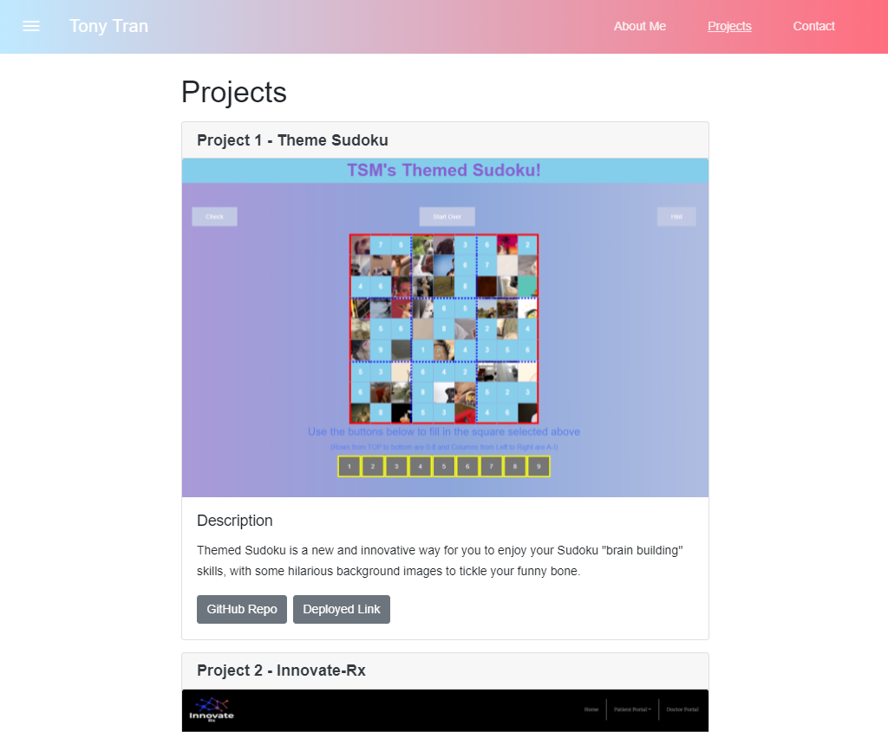

# tony-react-portfolio
This is my portfolio renovated with ReactJS! This was made using ReactJS, react-bootstrap, and react-MDL package.  

License: 

## Description 

This is my portfolio using create-react-app and built with inspiration from my previous portfolio using bootstrap. This application is to demonstrate the use of components, manage component state, and react router. 

Screenshots:

## Table of Contents

* [Installation](#installation)
* [Usage](#usage)
* [License](#license)
* [Contributing](#contributing)
* [Tests](#tests)
* [Questions](#questions)

## Installation

You can use the deployed application at the link provided below. 

## Usage 

You could contact me from my GitHub, LinkedIn or email me with the contact information below or on my deployed site. 

  - I've include 6 projects on the portfolio and they are pinned on my repo
  - Feel free to check out my repo for more projects
  - Message me on LinkedIn or any other means if you want to contact me

Deployed: 

## License

MIT

## Contributing

If you would like to contribute to this project, you can fork a copy of the repo and make changes or improvements on your repo. Once ready, you can request a push and I will review the changes before updating the repo. 

## Tests

There are no tests with this application. Let me know if you are interested in creating a test for this application. 

## Questions

If you have any questions, feel free to contact me and listed below are my contact informations. 

GitHub profile: code-monkey713

Email: tony.tran713@outlook.com
